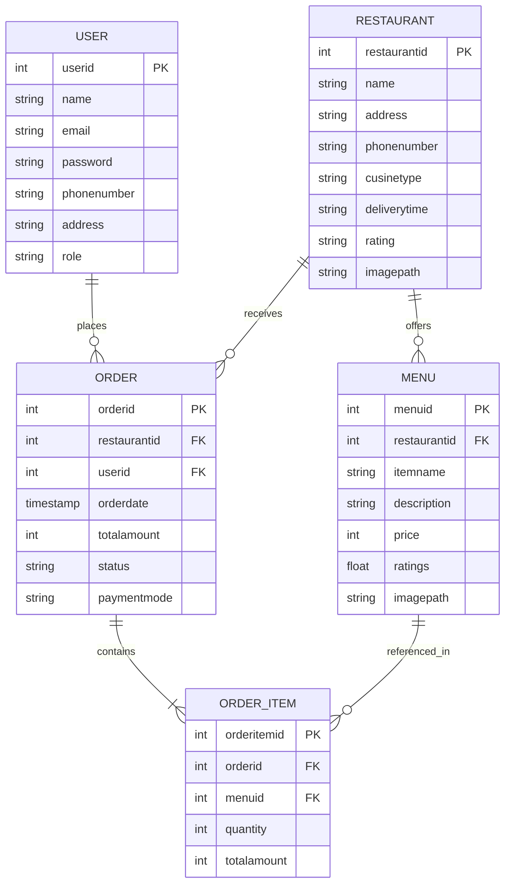

# 🍴 FoodZone — Online Food Delivery Platform

[](https://www.oracle.com/java/)
[](https://jakarta.ee/)
[](https://tomcat.apache.org/)
[](https://www.mysql.com/)
[](https://maven.apache.org/)
[](LICENSE)

> A modern, full-featured Java Enterprise web application inspired by **Swiggy & Zomato**, enabling users to explore restaurants across multiple cuisines, manage unified multi-restaurant carts, apply promo discount coupons, track live order status with digital invoice receipts, and reorder past meals with 1 click.

---

## 🌟 Key Features

### 🍽️ 1. Multi-Cuisine Restaurant Discovery
- Browse top-rated restaurants with cuisine types, ratings, and delivery ETA.
- **Quick Category Chips**: 1-click filtering for 🍗 *Biryani*, 🍕 *Pizza*, 🍔 *Burgers*, 🥟 *Chinese*, ☕ *South Indian*, 🍛 *North Indian*, 🍰 *Desserts*, and 🥗 *Healthy Bowls*.
- Real-time search across restaurant names, addresses, and dishes.

### 🛒 2. Unified Multi-Restaurant Shopping Cart
- Order food items from **multiple restaurants in a single cart session** without losing previously selected dishes.
- Real-time quantity adjustments (`+` / `−`), dynamic grand total calculation, and instant acknowledgement banners.
- Sticky floating bottom cart bar across menu pages.

### 🧾 3. Swiggy / Zomato Style Digital Billing & Live Tracking
- **Live Fulfillment Stepper**: Visual progress tracker (`Confirmed` ➔ `Cooking` ➔ `On the Way` ➔ `Delivered`).
- **Itemized Invoice Receipt**: Grouped by restaurant with veg/non-veg indicators, item quantity badges, and price breakdown.
- **Detailed Bill Summary**: Item subtotal, delivery fee (discounted to **FREE**), platform fee, 5% restaurant GST, applied coupon savings, and payment status badges (`PAID ONLINE (UPI / Card)`).
- **Print Receipt**: One-click printable receipt formatted for clean invoicing.

### 🏷️ 4. Promo Codes & Discount Engine
- Apply discount coupon codes at Cart / Checkout with instant feedback:
  | Coupon Code | Discount Offer | Minimum Order |
  | :--- | :--- | :--- |
  | **`WELCOME50`** | **50% OFF** (up to ₹100) | No minimum |
  | **`FOODZONE20`** | **20% OFF** (up to ₹150) | ₹200 |
  | **`FEAST100`** | **Flat ₹100 OFF** | ₹400 |
  | **`FREEDEL`** | **Free Delivery** | No minimum |

### 📜 5. "My Orders" History & 1-Click Reorder
- Dedicated order history dashboard displaying past orders with timestamps, restaurant details, dishes, and delivery status.
- **1-Click "Reorder All"**: Instantly re-adds all dishes from any past order into the active shopping cart.

### 🛵 6. Delivery Partner Profile & Contact
- Displays assigned delivery executive details (*e.g., Ramesh Kumar ⭐ 4.9 &bull; KA-01-EF-2490*) on the confirmation dashboard with direct contact actions.

### 🔐 7. User Authentication & Security
- User registration, login authentication, session management, and account lockout protection after repeated invalid attempts.

---

## 🛠️ Technology Stack

| Layer | Technologies |
| :--- | :--- |
| **Backend** | Java 17, Jakarta Servlet API 6.0, Jakarta JSP 3.1, JSTL 3.0, JDBC |
| **Frontend** | JSP, HTML5, Vanilla CSS3, JavaScript, FontAwesome 6 Icons |
| **Database** | MySQL 8.0 (Relational schema with foreign keys and cascading deletes) |
| **Server / Runtime** | Apache Tomcat 10.1 (Embedded Tomcat runner + Standalone WAR support) |
| **Build & Tooling** | Apache Maven 3.9, Git |

---

## 📂 Project Architecture & Directory Structure

```text
FoodDeliveryApp/
├── .gitignore
├── pom.xml                               # Root Maven Aggregator POM
├── README.md
└── FoodApp/
    ├── pom.xml                           # Submodule POM (Jakarta EE 10, Tomcat Embed, MySQL)
    ├── database/
    │   └── food_delivery.sql             # Database schema & rich sample dataset
    └── src/main/
        ├── java/com/foodapp/
        │   ├── Main.java                 # Standalone Embedded Tomcat 10.1 Launcher
        │   ├── DAO/                      # Data Access Object Interfaces
        │   │   ├── UserDAO.java
        │   │   ├── RestaurantDAO.java
        │   │   ├── MenuDAO.java
        │   │   ├── OrderDAO.java
        │   │   └── OrderItemDAO.java
        │   ├── DAOImpl/                  # JDBC Implementations
        │   │   ├── UserDAOImpl.java
        │   │   ├── RestaurantDAOImpl.java
        │   │   ├── MenuDAOImpl.java
        │   │   ├── OrderDAOImpl.java
        │   │   └── OrderItemDAOImpl.java
        │   ├── models/                   # Entity & Business Models
        │   │   ├── User.java
        │   │   ├── Restaurant.java
        │   │   ├── Menu.java
        │   │   ├── Cart.java
        │   │   ├── CartItem.java
        │   │   ├── Order.java
        │   │   └── OrderItem.java
        │   ├── Servlets/                 # Web Controllers
        │   │   ├── HomeServlet.java
        │   │   ├── MenuServlet.java
        │   │   ├── CartServlet.java
        │   │   ├── CheckoutServlet.java
        │   │   ├── ApplyCouponServlet.java
        │   │   ├── OrderHistoryServlet.java
        │   │   ├── ReorderServlet.java
        │   │   ├── SearchServlet.java
        │   │   ├── LoginServlet.java
        │   │   └── UserRegisterServlet.java
        │   └── util/
        │       └── DBConnection.java     # JDBC Connection Manager
        └── webapp/                       # JSP Views & Web Descriptor
            ├── index.jsp
            ├── home.jsp
            ├── menu.jsp
            ├── cart.jsp
            ├── checkout.jsp
            ├── my_orders.jsp
            ├── order_conformation.jsp
            ├── login.jsp
            ├── userregistration.jsp
            └── WEB-INF/
                └── web.xml
```

---

## 🗄️ Database Schema Design

The application uses a normalized relational MySQL schema with foreign key constraints:



---

## 🚀 Getting Started

### 1. Prerequisites
- **Java Development Kit (JDK 17+)**
- **Apache Maven 3.8+**
- **MySQL Server 8.0+**

---

### 2. Database Setup
1. Open your MySQL client or terminal:
   ```sql
   CREATE DATABASE food;
   ```
2. Import the schema and sample dataset located in `FoodApp/database/food_delivery.sql`:
   ```bash
   mysql -u root -p food < FoodApp/database/food_delivery.sql
   ```
3. Update MySQL credentials in `FoodApp/src/main/java/com/foodapp/util/DBConnection.java` if needed (defaults to `root` / `root` on `localhost:3306`).

---

### 3. Build & Run the Application

#### Option A: Run directly with Maven & Embedded Tomcat (Recommended)
```bash
# Navigate to the FoodApp directory
cd FoodApp

# Compile and start the server
mvn exec:java
```
The application will start immediately and be accessible at:
👉 **`http://localhost:8080`**

#### Option B: Build WAR Package for Standalone Tomcat
```bash
cd FoodApp
mvn clean package
```
Deploy the generated `FoodApp/target/FoodApp.war` file to your Tomcat `webapps/` folder.

---

## 🔑 Pre-Configured Test Credentials

| Role | Email | Password | Pre-configured Details |
| :--- | :--- | :--- | :--- |
| **Customer** | `john@example.com` | `password123` | Active customer with delivery address and order history |
| **Super Admin** | `admin@foodzone.com` | `admin123` | System Administrator |
| **Customer 2** | `jane@example.com` | `jane@123` | Verified customer |

---

## 📸 Application Workflow

1. **Sign In**: Log in using test credentials or register a new customer account.
2. **Explore Cuisines**: Use category chips (🍕 *Pizza*, 🍗 *Biryani*, etc.) or search bar to browse dishes and restaurants.
3. **Multi-Restaurant Cart**: Add dishes from multiple restaurants; review quantity and item subtotals.
4. **Apply Coupons**: Enter promo code `WELCOME50` for instant 50% discount.
5. **Checkout**: Select payment mode (UPI, Card, COD) and place order.
6. **Live Invoice & Tracker**: View live cooking progress, itemized bill receipt, and delivery executive details.
7. **Order History & Reorder**: Open *My Orders* to view order timeline or 1-click reorder any meal.

---

## 📄 License
This project is open-source and available under the [MIT License](LICENSE).
